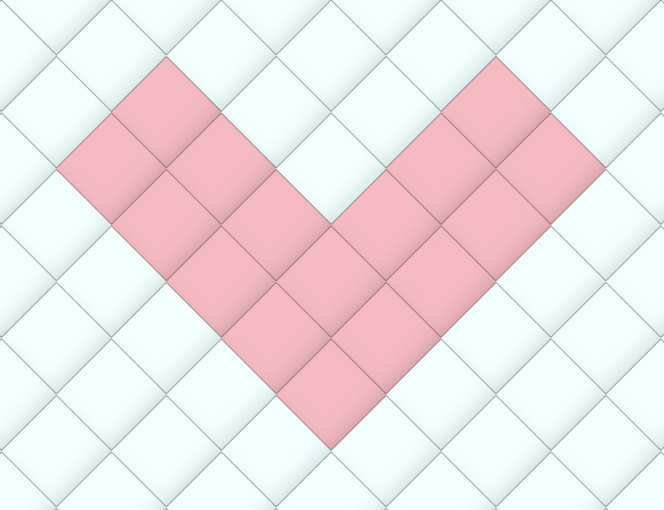

# Offputting Heartshape on Roku Tv Autoplay video

A few days ago I wasn't interacting with my Roku TV but it was turned on, so eventually the autoplay homescreen video started playing in the backround. I looked at it and i saw this very off putting heart shape that was obviously made out of squers. It looked something like this:

I wanted to see how hard it is to make an appealing heart shape using a squer pattern. Turns out the best heart i could create wasn't that great either. 
